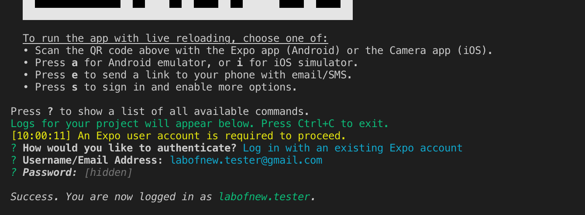
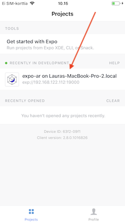
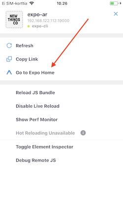

# Exercise 1: Hello World with Expo App

## Step 1: Environment setup
* [Setup the environment](../README.md#environment-setup)

## Step 2: Start development server
* In Terminal, run
  ```
  npm install
  npm start
  ```

## Step 3: Use Terminal to sign in to Expo service
* Sign in to expo with your laptop (press s in Terminal).

  
 
* Restart the development server: Press Ctrl+C in Terminal and type
  ```
  npm start
  ```

## Step 4: Open your app
* Open the Expo mobile app and check the projects tab. It should have your project listed there.

  

* Open the app and you should see the text "Hello World!".

## Step 5: Update code
* Try then the live reloading feature: edit the text in ./src/index.js. Remember to save the file.
* Your changes should be loaded automatically in the mobile app.

## Step 6: Close app
* Shake the device to see the Expo client app menu and navigate back to home menu.

  

Great, it seems you are now a mobile app developer! Now you can move on to [exercise 2](./ex2.md).