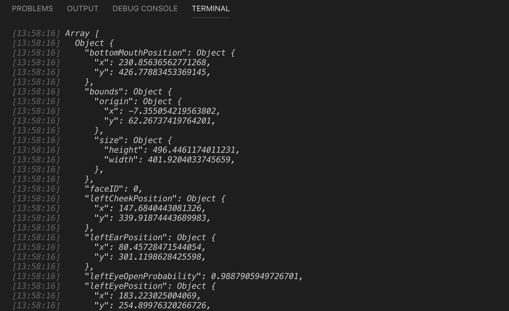
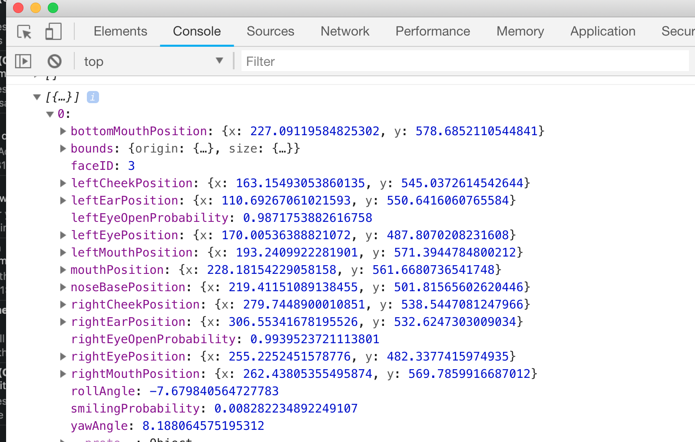

# Exercise 2: Face detection

## Step 1: Stateful component
Convert the pure component in the app main view to a React stateful component: replace code in src/index.js with following:

*src/index.js*
```JavaScript
import React from 'react'
import { Text, View } from 'react-native'

const flexCenterStyle = { flex: 1, justifyContent: 'center', alignItems: 'center' }

class MainView extends React.Component {
  constructor(props) {
    super(props)
  }

  componentDidMount() {
  }

  render() {
    return (
    <View style={flexCenterStyle}>
      <Text>Hello World!</Text>
    </View>
    )
  }
}

export default MainView
```

Now you have a stateful React component in which you can implement the needed functionality.

## Step 2: Ask camera permission

Ask Camera permission in the component initialisation phase.

*src/index.js*
```JavaScript
import React from 'react'
import { Text, View } from 'react-native'
// import Permissions related logic from Expo library
import { Permissions } from 'expo'

const flexCenterStyle = { flex: 1, justifyContent: 'center', alignItems: 'center' }

class MainView extends React.Component {
  constructor(props) {
    super(props)
    this.state = {
       // initialize flag for camera permission
      hasCameraPermission: null
    }
    // bind the camera permission callback
    // to set the correct context
    this.onCameraPermission = this.onCameraPermission.bind(this)
  }

  componentDidMount() {
    // when component is initialized
    // user is asked for permission to use the camera
    Permissions
      .askAsync(Permissions.CAMERA)
      .then(this.onCameraPermission)
  }

  onCameraPermission({ status }) {
    // camera permission flag is updated once
    // when the user has dismissed the dialog
    this.setState({ hasCameraPermission: status === 'granted' })
  }

  render() {
    return (
    <View style={flexCenterStyle}>
      <Text>Hello World!</Text>
    </View>
    )
  }
}

export default MainView
```

## Step 3: Show camera

Modify the main view of your app to show the front camera feed.

*src/index.js*
```JavaScript
import React from 'react'
import { Text, View } from 'react-native'
// Use Camera component from Expo library
import { Camera, Permissions } from 'expo'

const cameraStyle = { flex: 1 } // fill the whole screen with camera component
const flexCenterStyle = { flex: 1, justifyContent: 'center', alignItems: 'center' }

class MainView extends React.Component {
  constructor(props) {
    super(props)
    this.state = {
      hasCameraPermission: null
    }
    this.onCameraPermission = this.onCameraPermission.bind(this)
  }

  componentDidMount() {
    Permissions
      .askAsync(Permissions.CAMERA)
      .then(this.onCameraPermission)
  }

  onCameraPermission({ status }) {
    this.setState({ hasCameraPermission: status === 'granted' })
  }

  render() {
    // Use destructuring to read camera permission value
    const { hasCameraPermission } = this.state;

    // Flag not initialized, permission dialog is not yet dismissed.
    // -> Return an empty view.
    if (hasCameraPermission === null) {
      return <View />
    }

    // User did not give permission to use the camera
    // -> Show error message
    if (hasCameraPermission === false) {
      return (
        <View style={flexCenterStyle}>
          <Text>No access to camera</Text>
        </View>
        )
    }

    // Camera permission ok, show camera component
    return (
      <View style={cameraStyle}>
        <Camera
          style={cameraStyle}
          type={Camera.Constants.Type.front}
        />
      </View>
    )
  }
}

export default MainView
```

## Step 4: Detect faces
Add face detection functionality to your camera component and log found face data. Monitor the log output from the Terminal.

*src/index.js*
```JavaScript
import React from 'react'
import { Text, View } from 'react-native'
// Import FaceDetector from expo lib
import { Camera, FaceDetector, Permissions } from 'expo'

const cameraStyle = { flex: 1 }
const flexCenterStyle = { flex: 1, justifyContent: 'center', alignItems: 'center' }

class MainView extends React.Component {
  constructor(props) {
    super(props)
    this.state = {
      hasCameraPermission: null,
      faces: [] // initialize found faces with empty array
    }
    this.onCameraPermission = this.onCameraPermission.bind(this)
    // bind the callbacks
    // to set the correct context
    this.onFacesDetected = this.onFacesDetected.bind(this)
    this.onFaceDetectionError = this.onFaceDetectionError.bind(this)
  }

  componentDidMount() {
    Permissions
      .askAsync(Permissions.CAMERA)
      .then(this.onCameraPermission)
  }

  onCameraPermission({ status }) {
    this.setState({ hasCameraPermission: status === 'granted' })
  }

  // implement face detection callback function
  onFacesDetected({ faces }) {
    // print the found face data to console
    console.log(faces)
    // store faces to component state
    this.setState({ faces })
  }

  // implement face detection error function
  onFaceDetectionError(error) {
    console.log(error)
  }

  render() {
    const { hasCameraPermission } = this.state;

    if (hasCameraPermission === null) {
      return <View />
    }

    if (hasCameraPermission === false) {
      return (
        <View style={flexCenterStyle}>
          <Text>No access to camera</Text>
        </View>
        )
    }

    return (
      <View style={cameraStyle}>
        {/*
          Enable face detector in camera component
          mode: fast or accurate,
          detectLandmarks: whether to get the eyes, nose, mouth position
          runClassifications: eyes open and smiling probability
         */}
        <Camera
          style={cameraStyle}
          type={Camera.Constants.Type.front}
          faceDetectorSettings={{
            mode: FaceDetector.Constants.Mode.fast,
            detectLandmarks: FaceDetector.Constants.Landmarks.all,
            runClassifications: FaceDetector.Constants.Classifications.all
          }}
          onFacesDetected={this.onFacesDetected}
          onFacesDetectionError={this.onFacesDetectionError}
        />
      </View>
    )
  }
}

export default MainView
```

When you point the camera at your face, you should see the data logged in the console.

 

You can also use the Chrome developer tools for monitoring the debug log. Open the Expo menu while the app is running (shake the device) and choose "Debug Remote JS". Open Chrome Developer Tools (press  ⌘ + ALT + i) and activate the Console tab. You should see the face data.

 


Great, it seems you are now an experienced React developer! You can now move on to [exercise 3](./ex3.md).