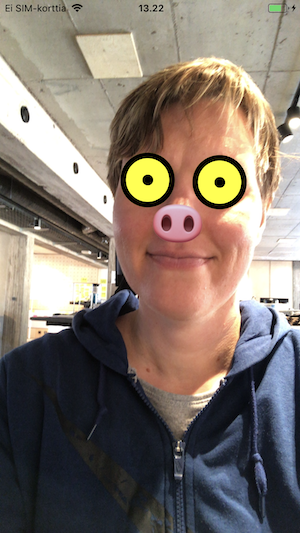

# Exercise 3: "Snapchat" filter

In this exercise we draw a mask on top of the detected face.



## Step 1: Create a new file

Create subfolder src/Mask. In that folder, create file index.js.

## Step 2: Add basic component implementation

Add basic component implementation to the newly created file.

*src/Mask/index.js*
```JavaScript
import React from 'react'

import { View } from 'react-native';

const Mask = ({ face }) => {
  console.log(face)
  return (
    <View />
  );
};

export default Mask
```

## Step 3: Integrate mask to main view

Render the mask for each found face.

*src/index.js*

```JavaScript
import React from 'react'
import { Text, View } from 'react-native'
import { Camera, FaceDetector, Permissions } from 'expo'

// Import the Mask component
import Mask from './Mask'

const cameraStyle = { flex: 1 }
const flexCenterStyle = { flex: 1, justifyContent: 'center', alignItems: 'center' }

class MainView extends React.Component {
  constructor(props) {
    super(props)
    this.state = {
      hasCameraPermission: null,
      faces: []
    }
    this.onCameraPermission = this.onCameraPermission.bind(this)
    this.onFacesDetected = this.onFacesDetected.bind(this)
    this.onFaceDetectionError = this.onFaceDetectionError.bind(this)
  }

  componentDidMount() {
    Permissions
      .askAsync(Permissions.CAMERA)
      .then(this.onCameraPermission)
  }

  onCameraPermission({ status }) {
    this.setState({ hasCameraPermission: status === 'granted' })
  }

  onFacesDetected({ faces }) {
    this.setState({ faces })
  }

  onFaceDetectionError(error) {
    console.log(error)
  }

  render() {
    // Read faces by destructuring state
    const { faces, hasCameraPermission } = this.state;

    if (hasCameraPermission === null) {
      return <View />
    }

    if (hasCameraPermission === false) {
      return (
        <View style={flexCenterStyle}>
          <Text>No access to camera</Text>
        </View>
        )
    }

    return (
      <View style={cameraStyle}>
        <Camera
          style={cameraStyle}
          type={Camera.Constants.Type.front}
          faceDetectorSettings={{
            mode: FaceDetector.Constants.Mode.fast,
            detectLandmarks: FaceDetector.Constants.Landmarks.all,
            runClassifications: FaceDetector.Constants.Classifications.all
          }}
          onFacesDetected={this.onFacesDetected}
          onFacesDetectionError={this.onFacesDetectionError}
        />
        {
          // For each face draw the mask
          faces.map(face => <Mask key={face.faceID} face={face} />)
        }
      </View>
    )
  }
}

export default MainView
```

## Step 4: Draw mask eyes

Draw yellow circles on top of user eyes.

*src/Mask/index.js*

```JavaScript
import React from 'react'

import { View } from 'react-native';

// Destructure face data given as argument
const Mask = ({
  face: {
    bounds: {
      origin: { x: containerX, y: containerY },
      size: { width: faceWidth }
    },
    leftEyePosition,
    rightEyePosition
  }
}) => {
  // Define the helpers for calculating the correct positions
  const eyeWidth = faceWidth / 4

  const translatedEyePositionX = eyePosition => eyePosition.x - eyeWidth / 2 - containerX
  const translatedEyePositionY = eyePosition => eyePosition.y - eyeWidth / 2 - containerY

  const translatedLeftEyePosition = {
    x: translatedEyePositionX(leftEyePosition),
    y: translatedEyePositionY(leftEyePosition)
  }
  const translatedRightEyePosition = {
    x: translatedEyePositionX(rightEyePosition),
    y: translatedEyePositionY(rightEyePosition)
  }

  // Define the style for the eye component
  const eyeStyle = (eyePosition, eyeBorderWidth = eyeWidth / 10) => ({
    position: 'absolute',
    left: eyePosition.x,
    top: eyePosition.y,
    borderRadius: eyeWidth,
    width: eyeWidth,
    height: eyeWidth,
    borderWidth: eyeBorderWidth,
    borderColor: 'black',
    backgroundColor:'yellow'
  });

  return (
    <View style={{ position: 'absolute', left: containerX, top: containerY }}>
      { /* Add left eye */ }
      <View style = {{...eyeStyle(translatedLeftEyePosition)}} />
      { /* Add right eye */ }
      <View style = {{...eyeStyle(translatedRightEyePosition)}} />
    </View>
  );
};

export default Mask
```

## Step 5: Draw pupils to mask eyes

Draw black dots in the middle of the yellow circles.

*src/Mask/index.js*
```JavaScript
import React from 'react'

import { View } from 'react-native';

const Mask = ({
  face: {
    bounds: {
      origin: { x: containerX, y: containerY },
      size: { width: faceWidth }
    },
    leftEyePosition,
    rightEyePosition
  }
}) => {
  const eyeWidth = faceWidth / 4
  // Define the pupil width
  const pupilWidth = eyeWidth / 5

  const translatedEyePositionX = eyePosition => eyePosition.x - eyeWidth / 2 - containerX
  const translatedEyePositionY = eyePosition => eyePosition.y - eyeWidth / 2 - containerY

  const translatedLeftEyePosition = {
    x: translatedEyePositionX(leftEyePosition),
    y: translatedEyePositionY(leftEyePosition)
  }
  const translatedRightEyePosition = {
    x: translatedEyePositionX(rightEyePosition),
    y: translatedEyePositionY(rightEyePosition)
  }

  const eyeStyle = (eyePosition, eyeBorderWidth = eyeWidth / 10) => ({
    position: 'absolute',
    left: eyePosition.x,
    top: eyePosition.y,
    borderRadius: eyeWidth,
    width: eyeWidth,
    height: eyeWidth,
    borderWidth: eyeBorderWidth,
    borderColor: 'black',
    backgroundColor:'yellow'
  });

  // Define the style for pupil component
  const adjustedPupilPosition = coord => coord + eyeWidth / 2 - pupilWidth
  const pupilStyle = (eyePosition) => ({
    position: 'absolute',
    left: adjustedPupilPosition(eyePosition.x),
    top: adjustedPupilPosition(eyePosition.y),
    borderRadius: pupilWidth,
    width: pupilWidth,
    height: pupilWidth,
    backgroundColor:'black'
  });

  return (
    <View style={{ position: 'absolute', left: containerX, top: containerY }}>
      <View style = {{...eyeStyle(translatedLeftEyePosition)}} />
      { /* Add left pupil component */ }
      <View style = {{...pupilStyle(translatedLeftEyePosition)}} />
      <View style = {{...eyeStyle(translatedRightEyePosition)}} />
      { /* Add right pupil component */ }
      <View style = {{...pupilStyle(translatedRightEyePosition)}} />
    </View>
  );
};

export default Mask
```

## Step 6: Place nose

Draw pig nose emoji on top of user nose.

*src/Mask/index.js*
```JavaScript
import React from 'react'

// Import Text component
import { Text, View } from 'react-native';

const Mask = ({
  face: {
    bounds: {
      origin: { x: containerX, y: containerY },
      size: { width: faceWidth }
    },
    leftEyePosition,
    noseBasePosition, // nose position
    rightEyePosition
  }
}) => {
  const eyeWidth = faceWidth / 4
  const pupilWidth = eyeWidth / 5
  // Define nose width
  const noseWidth = eyeWidth;

  const translatedEyePositionX = eyePosition => eyePosition.x - eyeWidth / 2 - containerX
  const translatedEyePositionY = eyePosition => eyePosition.y - eyeWidth / 2 - containerY

  const translatedLeftEyePosition = {
    x: translatedEyePositionX(leftEyePosition),
    y: translatedEyePositionY(leftEyePosition)
  }
  const translatedRightEyePosition = {
    x: translatedEyePositionX(rightEyePosition),
    y: translatedEyePositionY(rightEyePosition)
  }

  const eyeStyle = (eyePosition, eyeBorderWidth = eyeWidth / 10) => ({
    position: 'absolute',
    left: eyePosition.x,
    top: eyePosition.y,
    borderRadius: eyeWidth,
    width: eyeWidth,
    height: eyeWidth,
    borderWidth: eyeBorderWidth,
    borderColor: 'black',
    backgroundColor:'yellow'
  });

  const adjustedPupilPosition = coord => coord + eyeWidth / 2 - pupilWidth / 2
  const pupilStyle = (eyePosition) => ({
    position: 'absolute',
    left: adjustedPupilPosition(eyePosition.x),
    top: adjustedPupilPosition(eyePosition.y),
    borderRadius: pupilWidth,
    width: pupilWidth,
    height: pupilWidth,
    backgroundColor:'black'
  });

  // Define style for nose component
  // Set the nose angle according to face angle
  const noseTransformAngle = (
    angleRad = Math.atan(
      (rightEyePosition.y - leftEyePosition.y) /
      (rightEyePosition.x - leftEyePosition.x)
    )
  ) => angleRad * 180 / Math.PI
    
  const noseStyle = () => ({
    fontSize: noseWidth,
    position: 'absolute',
    left: noseBasePosition.x - noseWidth / 2 - containerX,
    top: noseBasePosition.y - noseWidth / 2 - containerY,
    transform: [{ rotate: `${noseTransformAngle()}deg`}]
  })
  
  return (
    <View style={{ position: 'absolute', left: containerX, top: containerY }}>
      <View style = {{...eyeStyle(translatedLeftEyePosition)}} />
      <View style = {{...pupilStyle(translatedLeftEyePosition)}} />
      <View style = {{...eyeStyle(translatedRightEyePosition)}} />
      <View style = {{...pupilStyle(translatedRightEyePosition)}} />
      {/* Add nose component */}
      <Text style={{...noseStyle()}}>🐽</Text>
    </View>
  );
};

export default Mask
```

## Bonus Step: get creative

Now that you master the basic tools, you can creative and tune the mask as you wish. Try for example to use different colors or forms!

Great, it seems you can now do advanced computer graphics! You can now move on to [exercise 4](./ex4.md).