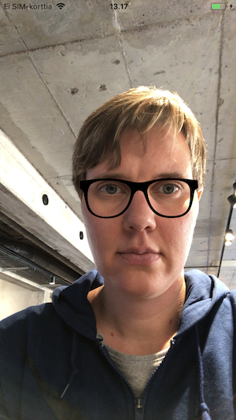

# Exercise 5: Embed image

In this exercise we render an image on top of the detected face



## Step 1: Create a new file

Create subfolder src/Glasses. In that folder, create file index.js.

## Step 2: Implement component with embedded image

*src/Glasses/index.js*
```JavaScript
import React from 'react'

import { Image, View } from 'react-native';

const Mask = ({
  face: {
    bounds: {
      size: { width: faceWidth, height: faceHeight }
    },
    leftEyePosition,
    rightEyePosition
  }
}) => {
  const glassesWidth = faceWidth
  const glassesHeight = faceHeight / 3
  const transformAngle = (
    angleRad = Math.atan(
      (rightEyePosition.y - leftEyePosition.y) /
      (rightEyePosition.x - leftEyePosition.x)
    )
  ) => angleRad * 180 / Math.PI
  return (
    <View style={{
      position: 'absolute',
      left: leftEyePosition.x - glassesWidth * 0.35,
      top: leftEyePosition.y - glassesHeight * 0.4
    }}>
      <Image
        source={require('../../assets/glasses.png')}
        style={{
          width: glassesWidth,
          height: glassesHeight,
          resizeMode: 'contain',
          transform: [{ rotate: `${transformAngle()}deg`}]
        }}
      />
    </View>
  );
};

export default Mask

```

## Step 3: Take new component in use

In your app Main view (src/index.js), replace use of Mask-component with newly created Glasses-component.
Check [exercise 3](ex3.md#step-3-integrate-mask-to-main-view) for details how to do this.

## Step 4: Test and enhance

Test the implementation.

Embed alternative image to app. You can find graphics for round glasses in assets-folder.

Think of ways how to improve UX and implementation.
